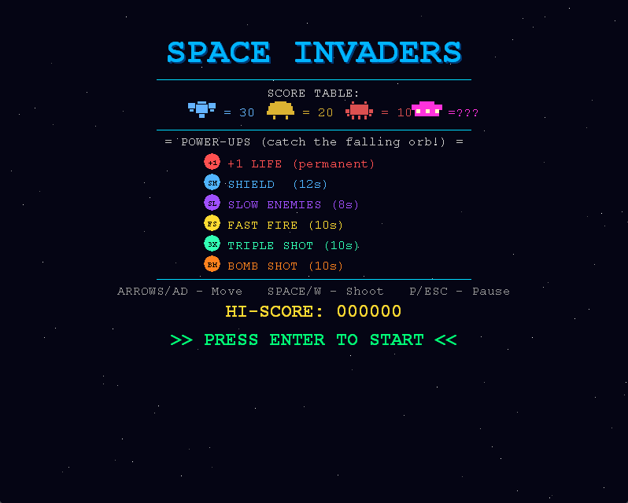
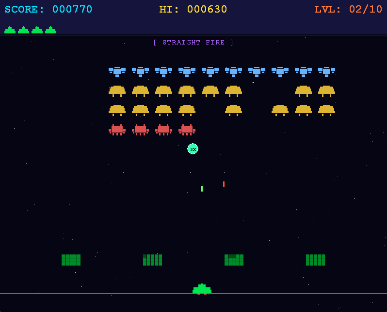
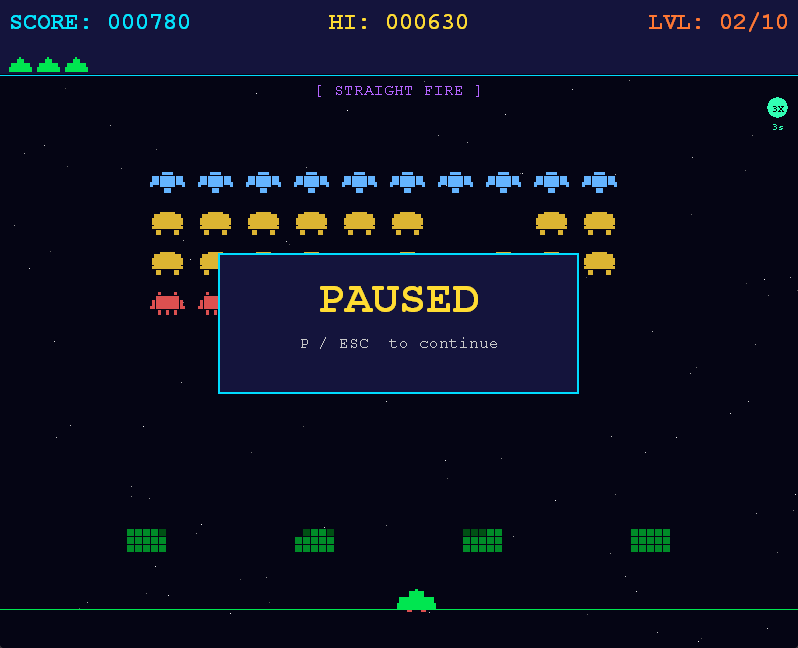
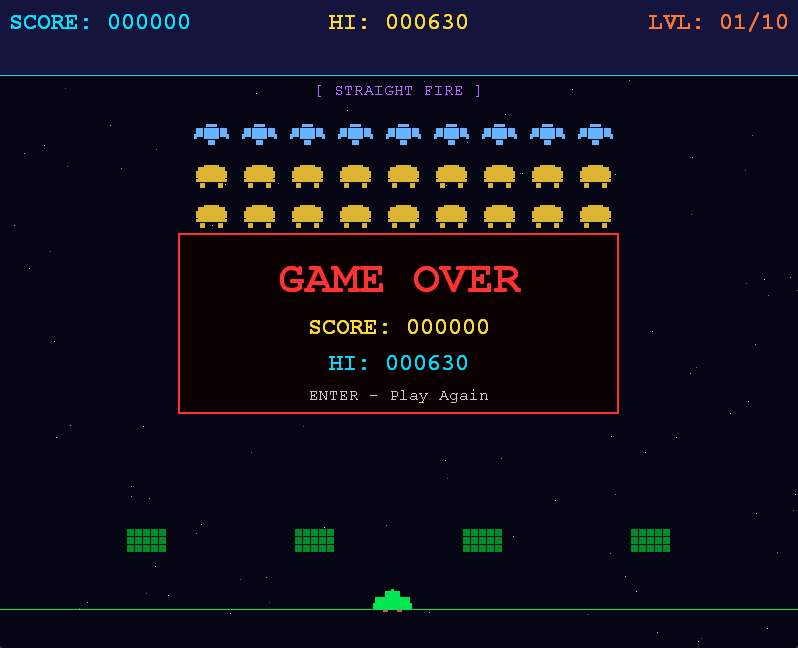

# 🚀 Space Invaders — Win32/C

Классическая аркадная игра **Space Invaders**, реализованная на чистом **C11** с
использованием **Win32 API** и **GDI** для графики. Проект выполнен в рамках
семестровой работы по дисциплине «Системное программирование».

---

## 🎮 Описание игры

Защищайте Землю от волн инопланетных захватчиков! Уничтожайте пришельцев,
прячьтесь за барьерами и набирайте очки. Игра содержит **10 уровней** с
нарастающей сложностью.

### Механика по уровням

| Уровень | Особенности |
|---------|-------------|
| 1–3     | Прямая стрельба вниз, медленная скорость |
| 4–6     | **Прицельная стрельба** — враги стреляют в текущую позицию игрока |
| 7–10    | **Медленное самонаведение** — пули медленно поворачивают к игроку |

С каждым уровнем:
- Увеличивается базовая скорость колонны пришельцев
- Ускоряются вражеские пули
- Уменьшается интервал выстрелов
- Появляется UFO (летающая тарелка) — сложнее, ценнее

---

## 🕹️ Управление

| Клавиша | Действие |
|---------|----------|
| `←` / `A` | Движение влево |
| `→` / `D` | Движение вправо |
| `SPACE` / `W` | Выстрел |
| `ENTER` | Начать игру / Продолжить |
| `P` / `ESC` | Пауза / Снять паузу |
| `ESC` (в меню) | Выход |

---

## 🏆 Таблица очков

| Враг | Очки |
|------|------|
| Пришелец тип A (нижний ряд) | 10 |
| Пришелец тип B (средние ряды) | 20 |
| Пришелец тип C (верхний ряд) | 30 |
| UFO (летающая тарелка) | 50–300 (случайно) |

---

## 🗂️ Архитектура проекта

```
space_invaders/
├── src/
│   ├── main.c               # Точка входа, оконная процедура, игровой цикл
│   ├── game.h/.c            # Игровая логика, состояние, коллизии, таймеры
│   ├── render.h/.c          # Отрисовка GDI, двойная буферизация
│   ├── input.h/.c           # Обработка ввода клавиатуры
│   ├── powerup/h            # Параметры усилений 
│   ├── levels.h/.c          # Параметры уровней
│   └── entities.h           # Структуры данных (Invader, Bullet, Player, ...)
├── assets/                  # Ресурсы (спрайты рисуются программно через GDI)
├── .vscode/
│   ├── tasks.json
│   ├── launch.json
│   └── c_cpp_properties.json
├──REALISES
│   ├──hiscore.dat           # Рекорд пользователя
│   └──cpace_invaders.exe    # Игра
├── CMakeLists.txt
├── README.md
└── report.md
```

### Модули

| Модуль | Файлы | Ответственность |
|--------|-------|-----------------|
| **core/logic** | `game.h`, `game.c`, `entities.h`, `levels.h`, `levels.c`, `powerup.h` | Игровая логика, физика, коллизии, AI, уровни, усиления |
| **ui/render** | `render.h`, `render.c` | Отрисовка, двойная буферизация, GDI-ресурсы |
| **input** | `input.h`, `input.c` | Опрос клавиш, обработка одиночных нажатий |
| **entry** | `main.c` | Win32 окно, игровой цикл, связь модулей |

---

## 🎨 Технические детали

- **Игровой цикл:** фиксированный шаг `1/60` сек с накоплением, `QueryPerformanceCounter`
- **Двойная буферизация:** `CreateCompatibleDC` + `BitBlt` — без мерцания
- **Ввод:** `GetAsyncKeyState` для плавного движения + `WM_KEYDOWN` для одиночных действий
- **Самонаведение:** постепенный поворот вектора скорости на угол не более `homingTurnRate * dt` рад/сек
- **AI стрельбы:** случайный выбор живой колонки, самый нижний пришелец стреляет
- **Хай-скор:** сохраняется в файл `hiscore.dat` (бинарно)
- **Нет сторонних библиотек:** только `<windows.h>`, `<math.h>`, `<stdlib.h>`, `<stdio.h>`

---

## 📸 Скриншоты







---

## 📦 Использованные .bmp файлы

Спрайты **не используются** — все объекты нарисованы программно через GDI
(`Rectangle`, `Polygon`, `SetPixel`). Папка `assets/` зарезервирована. 
